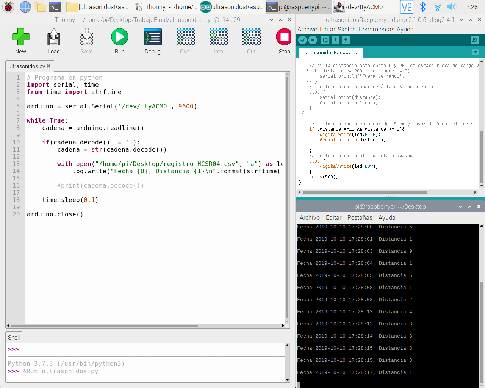

# Medidor de distancia con Arduino-Raspberry Pi generando fichero .csv

## Descripción

Se trata de capturar los datos de la distancia a un objeto capturados por un sensor de ultrasonidos HC-SR04 conectado a una placa Arduino. Esta placa se conecta a un puerto USB de la Raspberry Py para recoger a traves de la comunicación serie los datos y generar en el escritorio un archivo .csv.

En la siguiente captura de pantalla se ha ejecutado en la consola  el comando `tail -f registro_HCSR04.CSV` para ver en tiempo real los datos registrados.


 


 


## Materiales

- Placa Arduino
- Placa Rasberry Py
- Sensor de ultrasonidos HC-SR04
- 6 cables macho-macho
- Placa protoboard

## Código Arduino

```arduino
int trig = 10;  
int echo = 12;
int led = 13;

void setup() {
    Serial.begin (9600);

    pinMode(trig, OUTPUT); // sale la señal
    pinMode(echo, INPUT); //entra la señal
    pinMode(led,OUTPUT); //sale la señal
}

void loop() {
    long duration; //duración de la onda en llegar
    int distance;  // distancia recorrida de la onda
    
    //inicializamos el Trig desde apagado y esperamos 2 microsegundos
    digitalWrite(trig, LOW);
    delayMicroseconds(2);

    // activamos el Trig durante 10 microsegundos y luego lo apagamos
    digitalWrite(trig, HIGH);
    delayMicroseconds(10);
    digitalWrite(trig, LOW);

    // Echo recibe la señal  y  detectará el tiempo en que ha tardado en llegar la señal
    duration = pulseIn(echo, HIGH);  //en pulseIn  es una i mayúscula

    //la  siguiente fórmula calculará  la distancia recorrida
    distance = (duration/2)/29;  


    // si la distancia es menor de 15 cm y mayor de 0 cm  el Led se encenderá
    if (distance <=15 && distance >= 0){
        digitalWrite(led,HIGH);
        Serial.println(distance);
        
    }
    // de lo contrario el led estará apagado
    else {
        digitalWrite(led,LOW);
    }
    delay(500);
}

```


## Código Python

```python
import serial, time
from time import strftime

arduino = serial.Serial('/dev/ttyACM0', 9600)

while True:
    cadena = arduino.readline()
  
    if(cadena.decode() != ''):
        cadena = str(cadena.decode())
                       
        with open("/home/pi/Desktop/registro_HCSR04.csv", "a") as log:
            log.write("Fecha {0}, Distancia {1}\n".format(strftime("%Y-%m-%d %H:%M:%S"), cadena))
        
        #print(cadena.decode())
  
    time.sleep(0.1)

arduino.close()
```
