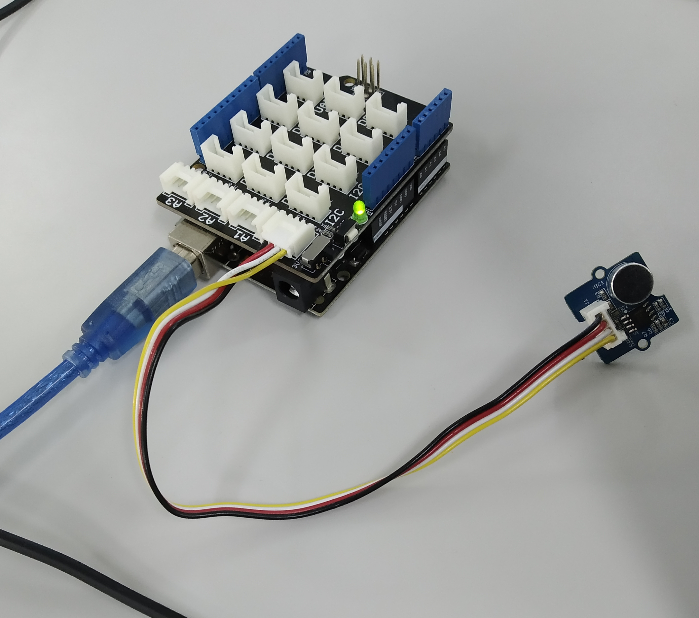
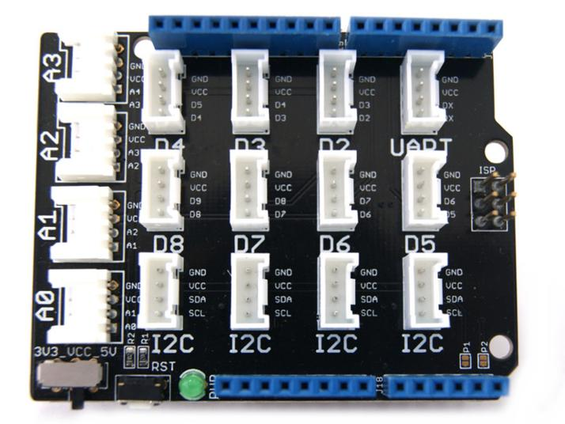

# Semáforo de ruido en el aula monitorizado por imágenes

Esta práctica consiste en registrar el nivel de ruido de un aula con un micrófono y mostrar una imagen en función de nivel detectado. 

El micrófono se conecta a Arduino UNO a través de un Shield.



Las imágenes que se mostrarán son:

#### Nivel bajo


#### Nivel medio


#### Nivel alto


## Materiales

- Arduino UNO

- Base Shield Arduino SEEED Grove V2



- Sensor de sonido Grove


| Especificaciones              |       |
| -------------------------------- | ------ |
|  Operating Voltage Range                      | 3.⅗ V     |
| Operating Current(Vcc=5V)          | 4~5 mA   |
| Voltage Gain(V=6V, f=1kHz) | 26 dB   |
| Microphone sensitivity(1kHz)              | 52-48 dB   |
| Microphone Impedance             | 2.2k Ohm   |
| Microphone Frequency              | 16-20 kHz   |
| Microphone S/N Radio             | 54 dB   |

## Programación en Arduino

```arduino
// Archivo original propiedad del IES Laurel de la Reina (La Zubia - Granada)
// Modificado por Antonio Luján (IES Santa María de los Baños - Murcia)

const int numeromuestras=128;//muestras tomadas para una lectura
int muestras;// reserva 2 bytes para la variable muestras
long senal;// reserva 4 bytes para la variable senal
long promedioLectura;

const long nivel1=190000;// marca el cambio del verde al amarillo
const long nivel2=200000;// marca el cambio del amarillo al rojo

int nivel_verde = 1; 
int nivel_amarillo = 2;
int nivel_rojo = 3;

void setup() {
  Serial.begin(9600);
  pinMode(A0, INPUT);  
}

void loop() {
  long sumamuestras=0;
  for (int i=0; i<numeromuestras; i++) {
    muestras=analogRead(A0);
    delay(10);// lee cada muestra con retardo de 10ms
    senal=senal*senal; //"dispara" las diferencias entre valores 
    sumamuestras=sumamuestras+senal;
  }
  promedioLectura=sumamuestras/numeromuestras;
 
  if (promedioLectura < nivel1) {      
      Serial.write(nivel_verde); //envía al serial un número que identifica el nivel verde
    //Serial.println(nivel_verde);
    } 
    
    if ((promedioLectura > nivel1) & (promedioLectura < nivel2)) {
 
     Serial.write(nivel_amarillo); //envía al serial un número que identifica el nivel amarillo
   // Serial.println(nivel_amarillo);
     }
     
     if (promedioLectura > nivel2) { 

    
    Serial.write(nivel_rojo); //envía al serial un número que identifica el nivel rojo
   //Serial.println(nivel_rojo);
     }
//Serial.println(promedioLectura); // Puede ser útil para calibrar
}
```

[semaforo-ruido-con-imagenes.ino](https://github.com/ElCableAmarillo/Practicas/blob/master/medidor-de-ruido-con-processing/semaforo-ruido-con-imagenes.ino)

## Programación en Processing

```arduino
/*
  Archivo original en fpbasicaelectricidad.blogspot.com
  Arduino + Processing: Semáforo de ruido
  ARCHIVOS DE PROCESSING CON POTENCIÓMETRO DE NIVEL
  MAYO DE 2016
  Modificado por Antonio Luján 10/10/2019
*/

import processing.serial.*; //Importamos la librería Serial
Serial port; //Nombre del puerto serie

int dato_puerto;
PImage imagen_rojo, imagen_amarillo, imagen_verde;

void setup()
{
  port = new Serial(this, Serial.list()[0] , 9600); //Abre el puerto serie /dev/ttyACM0
  size(450, 450); //Creamos una ventana de 450 píxeles de anchura por 450 píxeles de altura 
  imagen_rojo = loadImage("imagen_rojo.jpg");
  imagen_amarillo = loadImage("imagen_amarillo.jpg");
  imagen_verde = loadImage("imagen_verde.jpg");
  background(255,255,255);//Fondo de color blanco
  println(Serial.list()[0]);
}
 
void draw(){  
  //Recibir datos del sonido del Arduino 
  if(port.available() > 0) // si hay algún dato disponible en el puerto
  {
    dato_puerto = port.read();//Lee el dato y lo almacena en la variable "dato_puerto"
    if (dato_puerto == 1){
      image(imagen_verde, 0, 0);
    }
    else if (dato_puerto == 3){
      image(imagen_rojo, 0, 0);
    }
    else{
      image(imagen_amarillo, 0, 0);
    }
    println(dato_puerto);
    delay(1000);
  }
  else 
  {
    println (" Arduino desconectado del puerto USB");
  }
  println (port.available());
}

```

[Archivo processing (.pde)](https://github.com/ElCableAmarillo/Practicas/blob/master/medidor-de-ruido-con-processing/processing_imagenes/processing_imagenes.pde)

## Enlaces de interés

- [Web del micro](http://wiki.seeedstudio.com/Grove-Sound_Sensor/)
